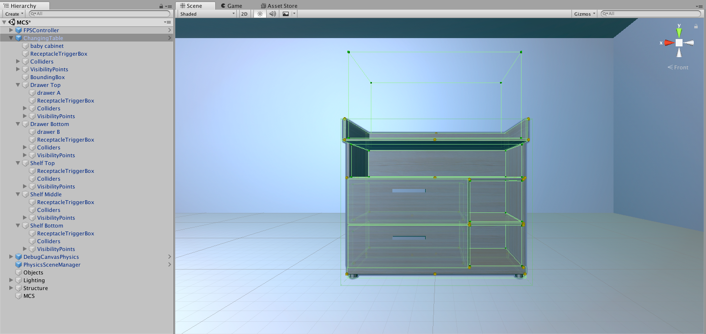

# Machine Common Sense Fork of AI2-THOR

Original documentation:  https://github.com/allenai/ai2thor

## Setup

### Editor

The CACI development team has worked on this Unity project with version 2019.4.X of the Unity Editor on both Linux and Mac.

Note for Linux developers: Our current fork of AI2-THOR has been upgraded to v2.5.0 and is configured to use Unity Editor version `2019.4.20`, but that version was not available for the Linux Unity Editor.  However, version [`2019.4.0f1`](https://forum.unity.com/threads/unity-on-linux-release-notes-and-known-issues.350256/page-2#post-5964977) does work fine.  Note that the Unity Hub download from Unity's Downloads page may not actually work on Linux (see the [Linux Installation Instructions](#linux-installation-instructions) below).

#### Linux Installation Instructions

Note that while installing and/or launching Unity, you may get an error about `libgconf-2.so.4`.  You should be able to solve this issue by `sudo apt install`-ing the library.

1. Download the `2019.4.0f1` "Official Installer" from the Unity Linux Editor forums [here](https://forum.unity.com/threads/unity-on-linux-release-notes-and-known-issues.350256/page-2#post-5964977).  The download is called `UnitySetup-2019.4.0f1`.

2. Run the `UnitySetup-2019.4.0f1` executable (you may need to `chmod` it).  This should install a `Unity-2019.4.0f1` folder.

3. In `Unity-2019.4.0f1/Editor/` run the `Unity` executable to start the Unity Hub.

4. Enter your MCS Unity License info into the Unity Hub.

5. In the Unity Hub, under the Projects tab, click Open and select the `/unity/` folder in your local clone of this repository.  This should add a "unity" project to your Projects list.

6. Double-click the "unity" project to launch the Unity Editor.  See [Run](#run) below for usage information.  Please note that the initial load of this project in the Unity Editor will take a long time.

### Assets

CACI employees and subcontractors: Checkout the [MCS private GitHub repository](https://github.com/NextCenturyCorporation/mcs-private) and copy the files from its `UnityAssetStore` folder into `unity/Assets/Addressables/MCS/UnityAssetStore/`.

Non-CACI employees: Please continue with the rest of these instructions.

## Run

If you want to run an MCS Scene in the Unity Editor:

1. Open the MCS Scene: `File->Open Scene` then select `Assets/Scenes/MCS.unity`

2. By default, in the Unity Editor, see the Hierarchy window on the left, the Scene and Game windows in the middle, the Inspector window on the right, and the Project and Console windows at the bottom.
  - The Hierarchy window lists the Game Objects in the Scene.
  - The Scene and Game windows show the Scene.
  - The Inspector window lists the properties, scripts, materials, and other components of the selected Game Object.
  - The Project window shows the files in the current project.
  - The Console window shows the logs and errors.

3. To successfully run an MCS Scene, copy a JSON scene configuration file from the [scenes folder in our MCS GitHub repository](https://github.com/NextCenturyCorporation/MCS/tree/master/python_api/scenes) into the [`unity/Assets/Resources/MCS/Scenes/`](./unity/Assets/Resources/MCS/Scenes/) folder, or identify a JSON file in the folder to use (like `playroom.json`).

4. Click on the `MCS` Game Object in the Hierarchy window. Then, in the Inspector Window, under the `MCS Main (Script)` component, enter the name of your selected JSON file in the `"Default Scene File"` property WITHOUT the `.json` extension.

5. If you want to see the class/depth/object masks, click on the `FPSController->FirstPersonCharacter` Game Object in the Hierarchy window, then toggle-on the checkbox next to the `Image Synthesis (Script)` component in the Inspector window to activate that script. You can see the masks during a run using the Display dropdown in the Game window.

6. Click the Play button in the top center of the Unity Editor to run the Scene. See the list of [keys and parameters](#keys-and-parameters) below. To set action parameters, click the `FPSController` Game Object in the Hierarchy window, then use the inputs under `Debug Discrete Agent Controller (Script)`. See [`unity/Assets/Scripts/DebugDiscreteAgentController.cs`](./unity/Assets/Scripts/DebugDiscreteAgentController.cs) for additional key bindings.

#### Keys and Parameters

- W/A/S/D: Move
- R: Rotate
  - Rotation Increment
  - Horizon Increment (positive is look down, negative is look up, resets if over +/-90)
- O: Open Object
  - Receptacle Object ID
  - Receptacle Object Direction (instead of using an object ID)
- C: Close Object
  - Receptacle Object ID (second object to put the held object onto)
  - Receptacle Object Direction (instead of using an object ID)
- P: Pickup Object
  - Move Or Pickup Object ID (for the held object)
  - Move Or Pickup Object Direction (instead of using an object ID)
- Z: Put (held) Object (onto an object)
  - Move Or Pickup Object ID (for the held object)
  - Move Or Pickup Object Direction (instead of using an object ID)
  - Receptacle Object ID (second object to put the held object onto)
  - Receptacle Object Direction (instead of using an object ID)
- X: Drop Object
  - Move Or Pickup Object ID (for the held object)
  - Move Or Pickup Object Direction (instead of using an object ID)
- U: Push or Pull Object
  - Move Or Pickup Object ID
  - Move Or Pickup Object Direction (instead of using an object ID)
  - Push Pull Force (positive is push, negative is pull)
- Q: Crawl
- E: Stand
- L: Lie Down
- Escape: Pass (do nothing)
- Backspace: Initialize (reset the current scene or go to a new scene)
  - New Scene File

## Build

Open the Unity Editor and build the project with `File->Build Settings`.  Check `Development Mode` and `Script Debugging` for detailed debug logging (but do NOT check these for any public release builds!).

Alternatively, if you want to build the Unity project via the command line, run the command below, replacing the path to your Unity executable file, log file name, `<cloned_repository>`, and the `executeMethod` as needed.  Please note that this command will build ALL the AI2-THOR scenes which will take a very long time (my only solution was to delete all the AI2-THOR scenes with `rm <cloned_repository>/unity/Assets/Scenes/FloorPlan*`).

```
./Unity-2019.4.0f1/Editor/Unity -quit -batchmode -logfile MCS-Unity-Build.log -projectpath <cloned_repository>/unity/ -executeMethod Build.Linux64
```

## TAR

To TAR the application's Data directory:

```
cd <cloned_repository>/unity/
tar -czvf MCS-AI2-THOR-Unity-App-<version>_Data.tar.gz MCS-AI2-THOR-Unity-App-<version>_Data/
```

## Important Files and Folders

- [`unity/`](./unity)  The MCS Unity project.  Add this folder as a project in your Unity Hub.
- `unity/Assets/Scenes/MCS.unity`  The MCS Unity Scene.  You can load and edit this in the Unity Editor.
- [`unity/Assets/Scripts/MachineCommonSenseConfig.cs`](./unity/Assets/Scripts/MachineCommonSenseConfig.cs)  A class with MCS config data: the "material registry", which lists Materials that may be loaded at runtime in the MCS scene; the "material colors", which maps Material names to color words.
- [`unity/Assets/Scripts/MachineCommonSenseMain.cs`](./unity/Assets/Scripts/MachineCommonSenseMain.cs)  The main MCS Unity script that is imported into and runs within the Scene.
- [`unity/Assets/Scripts/MachineCommonSenseController.cs`](./unity/Assets/Scripts/MachineCommonSenseController.cs)  A custom subclass extending AI2-THOR's [PhysicsRemoteFPSAgentController](./unity/Assets/Scripts/PhysicsRemoteFPSAgentController.cs) that handles player actions and state.
- [`unity/Assets/Scripts/MachineCommonSensePerformerManager.cs`](./unity/Assets/Scripts/MachineCommonSensePerformerManager.cs)  A custom subclass extending AI2-THOR's [AgentManager](./unity/Assets/Scripts/AgentManager.cs) that handles the communication between the Python API and the Unity Scene.
- [`unity/Assets/Scripts/MachineCommonSenseSceneManager.cs`](./unity/Assets/Scripts/MachineCommonSenseSceneManager.cs)  A custom subclass extending AI2-THOR's [PhysicsSceneManager](./unity/Assets/Scripts/PhysicsSceneManager.cs) that handles scene state.
- [`unity/Assets/Resources/MCS/`](./unity/Assets/Resources/MCS)  Folder containing all MCS runtime resources.
- [`unity/Assets/Resources/MCS/ai2thor_object_registry.json`](./unity/Assets/Resources/MCS/ai2thor_object_registry.json)  Config file containing the MCS Scene's specific Game Objects borrowed from the AI2-THOR framework that may be loaded at runtime. 
- [`unity/Assets/Resources/MCS/mcs_object_registry.json`](./unity/Assets/Resources/MCS/mcs_object_registry.json)  Config file containing the MCS Scene's specific custom Game Objects that may be loaded at runtime. 
- [`unity/Assets/Resources/MCS/primitive_object_registry.json`](./unity/Assets/Resources/MCS/primitive_object_registry.json)  Config file containing the MCS Scene's Unity Primitive Game Objects that may be loaded at runtime. 
- [`unity/Assets/Resources/MCS/Materials/`](./unity/Assets/Resources/MCS/Materials)  Copy of AI2-THOR's [`unity/Assets/QuickMaterials/`](./unity/Assets/QuickMaterials).  Must be in the `Resources` folder to access at runtime.
- [`unity/Assets/Resources/MCS/Scenes/`](./unity/Assets/Resources/MCS/Scenes)  Folder containing sample scene config files (see [Run](#run)).

## Differences from AI2-THOR Scenes

- The `FPSController` object is mostly the same, but I made it smaller to simulate a baby.  This also allowed me to downscale the room which not only improves performance but also was necessary to get the depth masks to work (while standing at one end of the room, you still want to see the far wall in the depth masks).  Changes affected the `Transform`, `Character Controller`, and `Capsule Collider` in the `FPSController` and the `Transform` in the `FirstPersonCharacter` (camera) nested inside the `FPSController`.
- In the `FPSController` object, I replaced the `PhysicsRemoteFPSAgentController` and `StochasticRemoteFPSAgentController` scripts with our `MachineCommonSensePerformerManager` script.
- In the `PhysicsSceneManager` object, I replaced the `AgentManager` script with our `MachineCommonSensePerformerManager` script.
- Added structural objects (walls, floor, ceiling).
- Added the invisible `MCS` object containing our `MachineCommonSenseMain` script that runs in the background.
- The `FPSController` prefab now has the AgentHand at the top level (instead of under `FirstPersonCharacter`), so that it is no longer affected by head tilt/camera.

## Code Workflow

### Shared Workflow

1. (Unity) `BaseFPSAgentController.ProcessControlCommand` will use `Invoke` to call the specific action function in `BaseFPSAgentController` or `PhysicsRemoteFPSAgentController` (like `MoveAhead` or `LookUp`)
2. (Unity) The specific action function will call `BaseFPSAgentController.actionFinished()` to set `actionComplete` to `true`

### Python API Workflow

1. (Python) **You** create a new Python AI2-THOR `Controller` object
2. (Python) The `Controller` class constructor will automatically send a `Reset` action over the AI2-THOR socket to `AgentManager.ProcessControlCommand(string action)`
3. (Unity) `AgentManager.ProcessControlCommand` will create a `ServerAction` from the action string and call `AgentManager.Reset(ServerAction action)` to load the MCS Unity scene
4. (Python) **You** call `controller.step(dict action)` with an `Initialize` action to load new MCS scene configuration JSON data and re-initialize the player
5. (Unity) The action is sent over the AI2-THOR socket to `AgentManager.ProcessControlCommand(string action)`
6. (Unity) `AgentManager.ProcessControlCommand` will create a `ServerAction` from the action string and call `AgentManager.Initialize(ServerAction action)`
7. (Unity) `AgentManager.Initialize` will call `AgentManager.addAgents(ServerAction action)`, then call `AgentManager.addAgent(ServerAction action)`, then call `BaseFPSAgentController.ProcessControlCommand(ServerAction action)` with the `Initialize` action
8. (Unity) See the [**Shared Workflow**](#shared-workflow)
9. (Unity) `AgentManager.LateUpdate`, which is run every frame, will see `actionComplete` is `true` and call `AgentManager.EmitFrame()`
10. (Unity) `AgentManager.EmitFrame` will return output from the `Initialize` action to the Python API (`controller.step`) and await the next action
11. (Python) **You** call `controller.step(dict action)` with a specific action
12. (Unity) The action is sent over the AI2-THOR socket to `AgentManager.ProcessControlCommand(string action)`
13. (Unity) `AgentManager.ProcessControlCommand` will create a `ServerAction` from the action string and call `BaseFPSAgentController.ProcessControlCommand(ServerAction action)` (except on `Reset` or `Initialize` actions)
14. (Unity) See the [**Shared Workflow**](#shared-workflow)
15. (Unity) `AgentManager.LateUpdate`, which is run every frame, will see `actionComplete` is `true` and call `AgentManager.EmitFrame()`
16. (Unity) `AgentManager.EmitFrame` will return output from the specific action to the Python API (`controller.step`) and await the next action

### Unity Editor Workflow

1. (Unity) Loads the Unity scene
2. (Editor) Waits until **you** press a key
3. (Unity) `DebugDiscreteAgentController.Update`, which is run every frame, will create a `ServerAction` from the key you pressed and call `BaseFPSAgentController.ProcessControlCommand(SeverAction action)`
4. (Unity) See the [**Shared Workflow**](#shared-workflow)
5. (Unity) `DebugDiscreteAgentController.Update` will see `actionComplete` is `true` and then waits until **you** press another key

## Lessons Learned (WIP)

- Adding AI2-THOR's custom Tags and Layers to your Game Objects is needed for their scripts to work properly.  For example, if you don't tag the walls as `Structure`, then the player can walk fully into them.
- Fast moving objects that use Unity physics, as well as all structural objects, should have their `Collision Detection` (in their `Rigidbody`) set to `Continuous`.  With these changes, a fast moving object that tries to move from one side of a wall to the other side in a single frame will be stopped as expected.
- The FPSController object's robot model is half scale, and ends up being about 0.5 high while the game is running.  I had to change the properties of the `Capsule Collider` and the `Character Controller` so the FPSController would not collide with the floor while moving (`PhysicsRemoteFPSAgentController.capsuleCastAllForAgent`).  Previously:  `center.y=-0.45`, `radius=0.175`, `height=0.9`.  Now:  `center.y=-0.05`, `radius=0.2`, `height=0.5` (though these numbers seem smaller than they should really be).

## Adding an Object to the MCS Scene

1. Create a Unity Prefab and save it in the `unity/Assets/Resources/MCS/` folder.
2. Add the relevant scripts and subcomponents to it (see the section below).
3. Add it to the `unity/Assets/Resources/MCS/mcs_object_registry.json` file with a unique ID and a path to the prefab.
4. Rebuild the Unity application.

## Modifying a Prefab to Work in the MCS Scene



Take a GameObject (we'll call it the "Target" object) containing a MeshFilter, MeshRenderer, and material(s). Sometimes the components are on the Target itself, and sometimes they are on a child of the Target.

1. Set the Tag of the Target to "SimObjPhysics" and set the Layer to "SimObjVisible".
2. Add a Rigidbody to the Target. Ensure its "Use Gravity" property is true.
3. If the Target (or its child) does not have any Colliders, you'll have to make them. Create an Empty Child under the Target called "Colliders" and mark it static. (AI2-THOR *should* be able to find colliders added to any child objects, as long as they're also set in the MyColliders property of the prefab's SimObjPhysics script.) Then create an Empty Child under "Colliders" for each Collider you need to make (give them useful names). On each child, add the correct Collider component (often a box, but sometimes others -- note that all MeshColliders should be CONVEX). Adjust the Transform of each child to position the Collider as needed. Set the Tag of each child to "SimObjPhysics" and set the Layer to "SimObjVisible".
4. Create an Empty Child under the Target called "VisibilityPoints" (no space!) and mark it static. Then create an Empty Child under "VisibilityPoints" for each visibility point you need to make. Adjust the Transform of each child to position the visibility point as needed. Set the Layer of each child to "SimObjVisible". A visibility point should be positioned on each corner of the Target, plus one or more points should be positioned on each large surface (think: if all the corners are occluded, can I still draw line-of-sight to the center of the Target?).
5. Create an Empty Child under the Target called "BoundingBox" (no space!) and add a BoxCollider component to it. Ensure this BoxCollider is NOT ACTIVE (but NOT the other Colliders). Adjust the Transform of the "BoundingBox" to completely enclose the Target. Set the Layer of the Target to "SimObjInvisible".
6. On the Target itself, add a SimObjPhysics component (it's an AI2-THOR script). Set the "Primary Property" to "Static" (for non-moveable objects), "Moveable", or "Can Pickup" (a subset of Moveable). Set the "Secondary Properties" as needed (like "Receptacle" and/or "Can Open"). Set the "Bounding Box" property to the "BoundingBox" child you created. Set the "Visibility Points" property to the visibility point children you created. Set the "My Colliders" property to the Collider children you created. Optionally, set the "Salient Materials" property as needed.
7. If the Target is openable, add a Can Open_Object component (AI2-THOR script) to the Target. Set the "Moving Parts" property to the Target. Set the "Open Positions" and the "Close Positions" to the correct positions. Change the "Movement Type" property to "Slide", "Rotate", or "Scale" as needed.
8. If the Target is a Receptacle, create an Empty Child under the Target called "ReceptacleTriggerBox" (no spaces!) and mark it static. Set the Tag of the "ReceptacleTriggerBox" to "Receptacle" and set the Layer to "SimObjInvisible". Add a "BoxCollider" component to the "ReceptacleTriggerBox" and set its "Is Trigger" property to true. Adjust the Transform of the "ReceptacleTriggerBox" to the receptacle area that can contain objects (I'm not sure if the height actually matters). Add a Contains component (AI2-THOR script) to the "ReceptacleTriggerBox".
9. For each other receptacle within the Target (like a cabinet door, drawer, shelf, etc.), create an Empty Child under the Target (we'll call this the Sub-Target), give it a useful name, and move the mesh corresponding to the Sub-Target to be under the child. Repeat steps 1-8 (EXCEPT the Bounding Box) on each Sub-Target.
10. Click-and-drag the finished Target into the Project tab of the Unity Editor to save it as a new Prefab file. Add a new entry for it in the mcs_object_registry file.

## ServerActionRecorder

A tool for recording of `ServerActions` to a file for playback. These files can currently only be played back within the Unity editor under `Tools -> ServerAction Recorder`.

Recorded files will be saved when the executable has been closed, or when the editor `Play Mode` has stopped. The files will be located within the `StreamingAssets -> Recording` folder.

To enable recording of a session:
- Editor
  - Add "RECORD_SERVERACTIONS" to `PlayerSettings -> Scripting Define Symbols`.

- Build
  - Add the command line argument `-RECORD_SERVERACTIONS` to your executable.

Location of recorded files:
- Editor
    `"\unity\Assets\StreamingAssets\Recordings"`
- Windows/Linux
    `"MCS-AI2-THOR-Unity-App-v#.#.#_Data\StreamingAssets\Recordings"`
- Mac
    `"MCS-AI2-THOR-Unity-App-v#.#.#\Resources\Data\StreamingAssets\Recordings"`

For playback:
1. Copy your recorded file into the editor path `"ai2thor\unity\Assets\StreamingAssets\Recordings"`
2. Open playback window through the toolbar `Tools -> ServerAction Recorder` 
3. Type your recorded file name into the `File Name` text field.
4. Click `Load` to load the file for playback
    - Any errors with the file with be directly showed in the window, with exceptions showing in the `Console` window.
5. Click `Play`
    - This will automatically start the editor with the loaded recording file.

## Changelog of AI2-THOR Classes

- `Scripts/AgentManager`:
  - Added properties to `MetadataWrapper`: `clippingPlaneFar`, `clippingPlaneNear`, `structuralObjects`
  - Added properties to `ObjectMetadata`: `colorsFromMaterials`, `direction`, `distanceXZ`, `heading`, `points`, `shape`, `visibleInCamera`
  - Added properties to `ServerAction`: `logs`, `objectDirection`, `receptacleObjectDirection`, `sceneConfig`
  - Added `virtual` to functions: `setReadyToEmit`, `Update`
  - Changed variables or functions from `private` to `protected`: `physicsSceneManager`, most `render*Image` variables
  - Changed properties in `ServerAction`: `horizon` (from int to float)
  - Changed variables or functions from `private` to `public`: `captureScreen`, 'renderImage'
  - Split the existing metadata-update-behavior of the `addObjectImageForm` function into a separate, new function called `UpdateMetadataColors`
  - Created the `InitializeForm` and `FinalizeMultiAgentMetadata` virtual functions and called them both inside `EmitFrame`
  - Changed `readyToEmit = true;` to `this.setReadyToEmit(true);` in `addAgents`, `ProcessControlCommand`, `Start`
  - Added Object Types: `Hollow`
  - Added property `consistentColors`
  - Added property `physicsFramesPerSecond`
- `Scripts/BaseFPSAgentController`:
  - Added `virtual` to functions: `Initialize`, `ProcessControlCommand`
  - Removed the hard-coded camera properties in the `SetAgentMode` function
  - Replaced the call to `checkInitializeAgentLocationAction` in `Initialize` with calls to `snapToGrid` and `actionFinished` so re-initialization doesn't cause the player to move for a few steps
  - Added `lastActionStatus` to `Initialize` to help indicate success or failure
  - Changed `nearestAngleIndex` to return the nearest index based on the minimum difference between the current angle and the angle at the index
  - Pulled out code for getting capsule parameters for agent from capsuleCastAllForAgent function to GetCapsuleInfoForAgent
  - Added factoring in scaling scaling to collider radius (now called adjustedRadius) in capsuleCastAllForAgent 
  - Changed maxVisibleDistance to 1.0
- `Scripts/CanOpen_Object`:
  - Rewrote part of the `Interact` function so it doesn't use iTween if `animationTime` is `0`.  Also the `Interact` function now uses the `openPercentage` on both "open" and "close".
  - Added `IsMovementTypeSlide` function
- `Scripts/Contains`:
  - Added function `RemoveFromCurrentlyContains` to temporarily get around ReceptacleObjects not updating when an object is picked up (and deactivated).
  - In `GetValidSpawnPoints`, rewrote the method so that it generates the spawn points based on the global UP (which may actually be down, left, right, forward, or back) rather than the receptacle object's local UP, so the grid may be X/Y, X/Z, or Y/Z.
  - In `CheckIfPointIsInsideReceptacleTriggerBox`, if the receptacle trigger box's parent object has the `Stacking` secondary property, just ensure that the point is above the receptacle trigger box's bottom Y point.
  - In `CheckIfPointIsInsideReceptacleTriggerBox`, fixed how the receptacle trigger box center and size are calculated so that its transform, its parent's transform(s), and its collider are all used.
  - Added the `FindReceptacleTriggerBoxSize` method to implemented the behavior in the previous bullet.
  - Removed the `CheckIfPointIsAboveReceptacleTriggerBox` method because it is no longer used (due to corresponding changes in `InstantiatePrefabTest`) and is also redundant with `CheckIfPointIsInsideReceptacleTriggerBox`.
  - Added `physicsFramesPerSecond` property
- `Scripts/DebugDiscreteAgentController`:
  - Calls `ProcessControlCommand` on the controller object with an "Initialize" action in its `Start` function (so the Unity Editor Workflow mimics the Python API Workflow)
  - Added a way to "Pass" (with the "Escape" button) or "Initialize" (with the "Backspace" button) on a step while playing the game in the Unity Editor
  - Added support for executing other actions and properties while playing the game in the Unity Editor
- `Scripts/InstantiatePrefabTest`:
  - In `PlaceObject`, fixed object rotation so that it always rotates around the global DOWN rather than using the receptacle object's local rotation.
  - In `PlaceObject`, removed the `HowManyCornersToCheck` behavior because it was buggy (there's no way to guarantee that the 4 correct corners are always the 4 bottom corners).
  - In `PlaceObject`, removed setting the object's rotation to the receptacle trigger box's rotation to keep the original rotation.
  - In `PlaceObject`, in the `HowManyRotationsToCheck` loop, fixed setting the object's rotation to properly use euler angles.
  - In `PlaceObject`, in the `ToCheck` loop, fixed setting the object's target position to handle objects with non-zero rotations.
  - In `CheckSpawnArea`, fixed how the object bounding box center and size are calculated so that its transform, its parent's transform, and its collider are all used.
- `Scripts/PhysicsRemoteFPSAgentController`:
  - Changed variables or functions from `private` to `protected`: `physicsSceneManager`, `ObjectMetadataFromSimObjPhysics`
  - Added `virtual` to functions: `CloseObject`, `DropHandObject`, `OpenObject`, `PickupObject`, `PullObject`, `PushObject`, `PutObject`, `ResetAgentHandPosition`, `ThrowObject`, `ToggleObject`
  - Commented out a block in the `PickupObject` function that checked for collisions between the held object and other objects in the scene because it caused odd behavior if you were looking at the floor.  The `Look` functions don't make this check either, and we may decide not to move the held object during `Look` actions anyway.
  - In the `PlaceHeldObject` function: ignores `PlacementRestrictions` if `ObjType` is `IgnoreType`; sets the held object's parent to null so the parent's properties (like scale) don't affect the placement validation; sets the held object's `isKinematic` property to `false` if placement is successful.
  - Added the `FindClosestPoint` function.
  - In `ApplyForceObject` and `PickupObject`, use `FindClosestPoint` to decide whether an object is obstructed or just out-of-reach.
  - Added `lastActionStatus` to Move actions, as well as to `DropHandObject`, `PickupObject`, and `PutObject` to help indicate success or reason for failure
  - Added check to make sure object exists for `DropHandObject`
  - Make sure objectId specified is actually the object being held for `DropHandObject` and `PutObject`
  - Undid objectId being reset to receptableObjectId and not allowing objects to be placed in closed receptacles regardless of type of receptacle for `PutObject`
  - In `PickupContainedObjects` and `DropContainedObjects`, added a null check for the Colliders object and added a loop over the colliders array in the SimObjPhysics script.
  - In `PickupContainedObjects`, don't pickup contained objects if the receptacle has the `Stacking` secondary property.
  - Added code to allow movement that will auto calculate the space to close the distance to an object within 0.1f
  - In 'CheckIfAgentCanTurn' and 'CheckIfAgentCanLook' add a check to see if object in hand is active
  - In `InteractAndWait`, parent objects within receptacles to that receptacle so they all move together when a receptacle is opened or closed.
  - Added logic to `InteractAndWait` to reset an object to its prior position if open/close action fails, and to increase the radius used to check if an agent is in the way of the object to be opened/closed.
  - For `OpenObject` and `CloseObject`, only use coroutine if physics are enabled.
  - In `isAgentCapsuleCollidingWith`, added expandBy parameter.
  - Added `isAgentOnTopOfObject` function to check for obstructions when opening objects that slide out (like drawers).
  - Change the layer of the `ItemInHand` to `SimObjInvisible` when picked up and to `SimObjVisible` when put/dropped/thrown.
- `Scripts/PhysicsSceneManager`:
  - Added `virtual` to functions: `Generate_UniqueID`
- `Scripts/SimObjPhysics`:
  - Added properties: `shape`
  - Changed the `Start` function to `public` so we can call it from our scripts
  - Added `ApplyRelativeForce` to apply force in a direction relative to the agent's current position.
  - In `FindMySpawnPoints`, ignore receptacle trigger boxes of stacking receptacles that are currently positioned higher than the receptacle itself (in case the receptacle is rotated).
- `Scripts/SimObjType`:
  - Added `IgnoreType` to the `SimObjType` enum, `ReturnAllPoints`, and `AlwaysPlaceUpright`
  - Added `Stacking` to the `SimObjSecondaryProperty` enum.
- `Scripts/MachineCommonSenseController`:
  - Added custom `RotateLook` to use relative inputs instead of absolute values.
  - Added checks to see whether objects exist and set lastActionStatus appropriately for `PutObject`
  - Added custom `ThrowObject` in order to use a relative directional vector to throw object towards.
  - Changed 'CheckIfAgentCanMove' to take a reference to a directionMagnitude instead of a copy parameter, so if distance to object is greater than zero, we can move a partial distance in 'moveInDirection' by adjusting the Vector3
  - If `PushObject` or `PullObject` is called on a held object, `ThrowObject` will be called instead of throwing an error.
  - Update ReceptacleObjects if needed in `PickupObject`.
- `Scripts/UtilityFunctions`:
  - Ignore checking collisions on ReceptacleTriggerBoxes in `isObjectColliding`
- `ImageSynthesis/ImageSynthesis`:
  - Added a null check in `OnSceneChange`
  - Changed to always use the `Hidden/Depth` Shader
  - Added property `guidForColors` and way to update it (`UpdateGuidForColors`). This is used to create random colors for object masks in `OnSceneChange`
- `ImageSynthesis/Shaders/Depth`:
  - Changed the `frag` function to return pixels based on the camera's far clipping pane

## Assets

- Soccer ball prefab from Ahmet Gencoglu: https://assetstore.unity.com/packages/3d/low-polygon-soccer-ball-84382

## Acknowledgements

This material is based upon work supported by the Defense Advanced Research Projects Agency (DARPA) and Naval Information Warfare Center, Pacific (NIWC Pacific) under Contract No. N6600119C4030. Any opinions, findings and conclusions or recommendations expressed in this material are those of the author(s) and do not necessarily reflect the views of the DARPA or NIWC Pacific.
