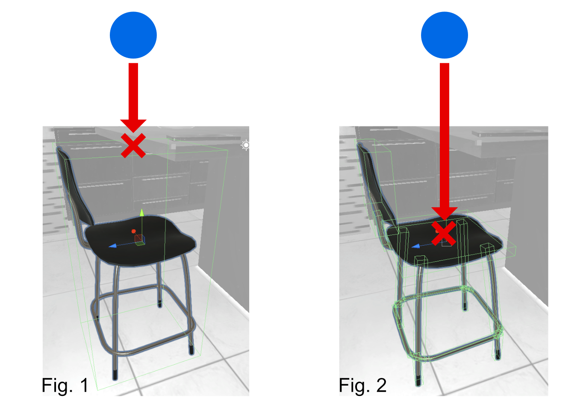
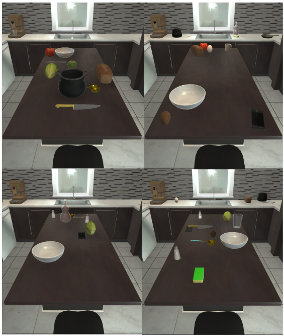
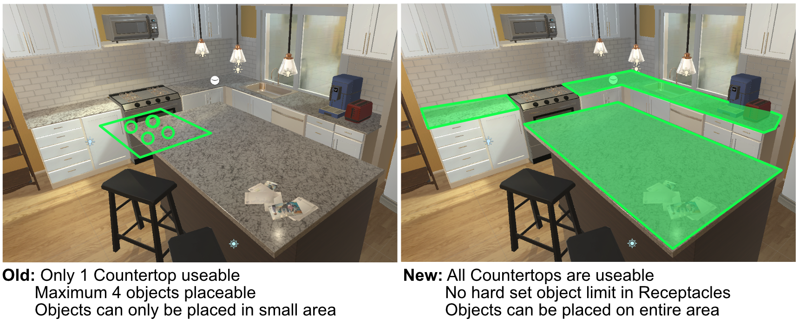
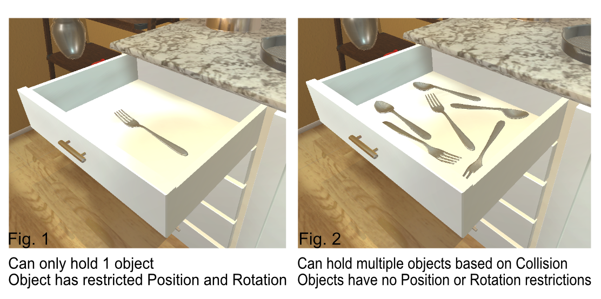
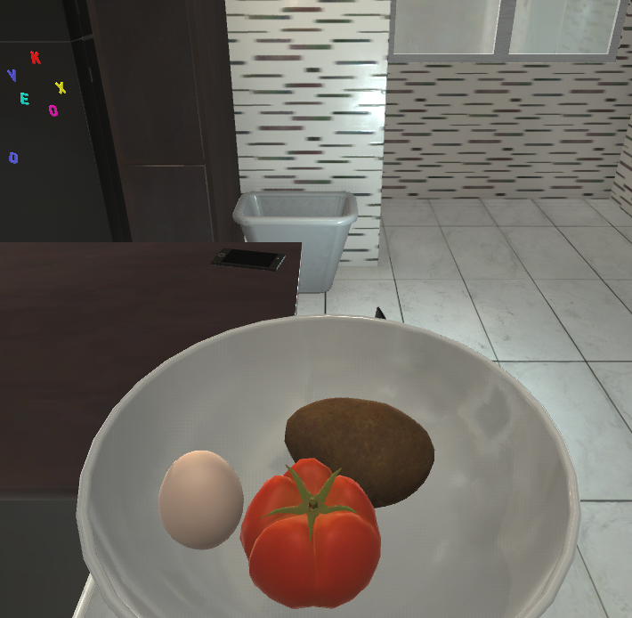
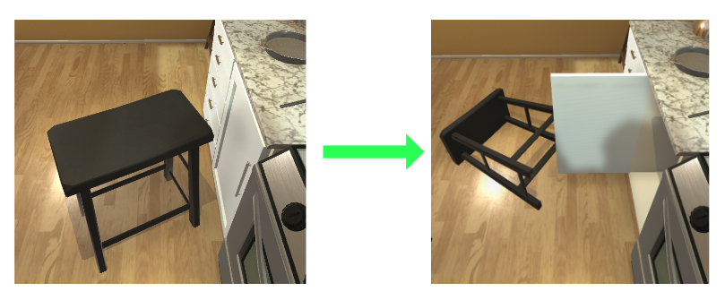
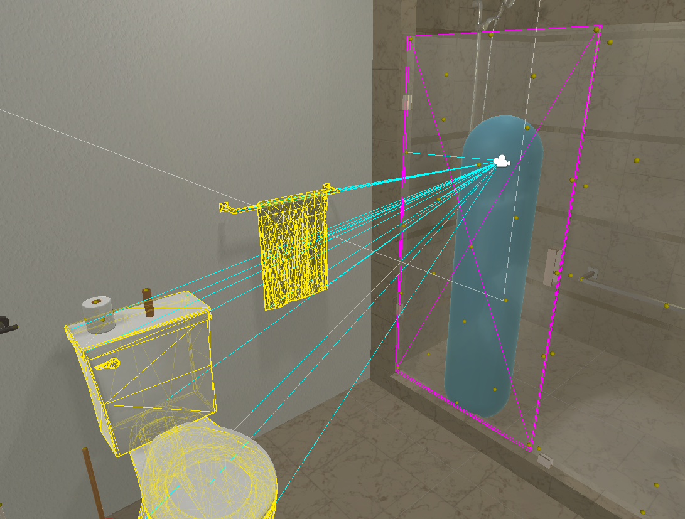
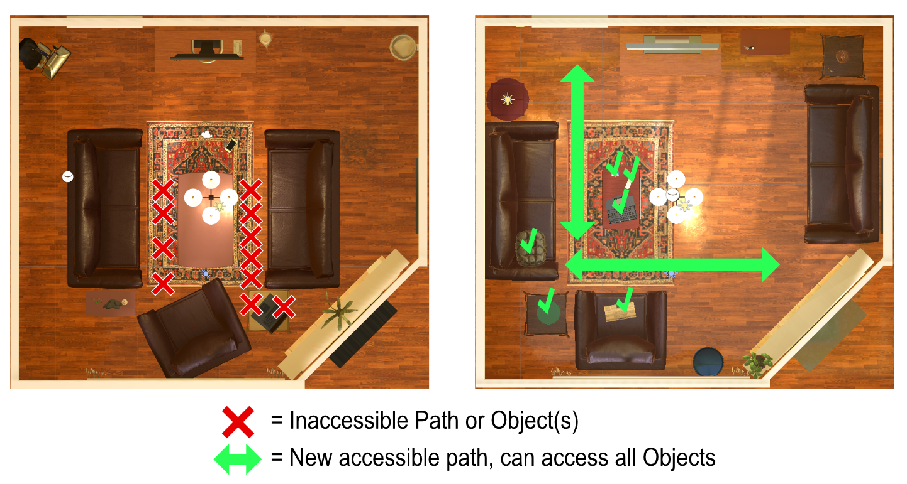
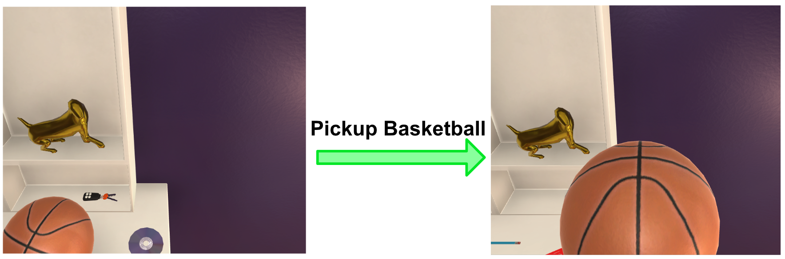

# AI2-THOR Version 1.0 Release Notes

## IMPORTANT NOTICE
Note that AI2-THOR 1.0 is not fully backwards compatible with previous versions due to some reworked architecture in the framework. For example, some object types have been deprecated (PaintingHanger), new object types have been introduced (Spatula), and certain actions (PutObject) now use entirely different logic to be compatible with physics. Several scenes have also had their layout re-arranged, so objects are not guaranteed to be found in their same position, and the entire room itself might be different.

## All Sim Objects Now Have Full Collision and Physics Interactions
All Sim Objects now have collision based physics behavior and accurate collision geometry. There are many implications to this:

More accurate collision geometry allows for realistic physics based interactions such as resolving interactions based on collision. Ex: you can now drop an object onto the seat of a chair and it will collide more realistically.

Fig. 1 and Fig. 2 compare how collision (represented by the light green boxes) has been updated, with Fig. 2 allowing the ball to bounce and hit the seat of the chair more realistically.

Any data, feedback, or interactions that might require realistic kinematic properties on Sim Objects will now be easily compatible within the THOR framework.

## Multi-Agent
Multi-Agent support has been added to the framework. This allows for teamwork oriented tasks that could involve any sort of agent to agent feedback or interaction.

## Object Location Randomization
Each scene now allows objects to be randomly moved to valid receptacles in a scene. Object randomization can be seeded and allows for exponentially more “scene states” of objects. Certain restrictions apply (large objects like Fridges, Sofas, etc. currently cannot be randomized). 

Objects have their locations randomized based on their receptacle restrictions (i.e. a tomato could appear on/in a TableTop, CounterTop, Microwave, or Fridge but won’t randomly spawn inside a Drawer).

This location randomization works in tandem with the new Receptacle fidelity improvements as well as collision to place objects in a larger variety of possible positions.

## More Sim Object Types
- Old: 86 Total Types
- New: 105 Total Types

Do note that some previous Sim Object Types have been deprecated or replaced in the new version of THOR, see all current Sim Object Types in the [Sim Object Info Table](https://docs.google.com/spreadsheets/d/1wx8vWgmFSi-4Gknkwl2fUMG8oRedu-tUklGSvU0oh4U/edit?usp=sharing).

## More Accurate Visibility of Objects
The entire form of an object is now considered when determining object visibility. Previously, objects were only considered visible if the Agent’s camera could draw a line from the center of the camera directly to the center of the object. Fig. 1 shows the Agent tracking the Bread’s visibility using the previous logic.

Now, if the Agent’s camera can draw a line to any part of the object’s form, it is considered visible as shown with the Bread in Fig. 2.

## Increased Variety of Receptacle Types
- Old: 15 total Types of Receptacle
- New: 33 total Types of Receptacle

More Sim Object types are now useable receptacles, increasing the variety and quantity of interactions across all scenes. For example, Plates were previously not receptacles, but now they are.

## Increased Available Receptacles in All Scenes
Not only are more objects types usable as receptacles, Scenes now have more environmental structures usable as Receptacles (tables, counters, etc), increasing the total usable Receptacle area. Green outlined zones indicate usable Receptacle space in the example below:

This update allows the Agent more options to pick up, place, reposition, and interact with objects in all scenes. 

## Improved Receptacle Functionality and Fidelity
Receptacles have been upgraded to allow object placement in positions across the entirety of their surface. Fig. 1 shows a drawer that was limited to a single object placed at a single point and rotation.

Fig. 2 shows an updated drawer that adds additional valid positions for objects to be placed as well as unrestricted rotation. These changes have been applied to all Receptacle types.

## Moveable Receptacles
Any receptacles that can be picked up now allow collective manipulation of objects currently contained by that receptacle. Interaction sequences like “Place Egg in Bowl -> Pickup Bowl with Egg in it” are now possible.

## Animated Opening and Closing of Receptacles
The Open/Close action on openable receptacles now has an animation. This animation is also affected by physics (i.e. attempting to open a Cabinet if a Chair was in the way would cause the Chair to be pushed out of the way).

## Redefined Visibility and Interactability 
Originally, an object was only interactable if it was defined as “visible”. Now, Visibility and Interactability have been split to account for cases like a Toilet being “visible” through a glass Shower Door. In this case, the Toilet is reported as Visible to the Agent, but it cannot be interacted with through the door, since the Agent can’t reach it. See the image in the Debug mode below:

Objects highlighted in Magenta are Visible and Interactable to the Agent. Objects highlighted only in Yellow are Visible to the Agent, but cannot be interacted with unless the transparent object blocking access is moved or if the Agent were to move to a different viewing angle (See Object Transparency below). The agent might have to perform a sequence of actions like “Open Shower Door, Open Toilet” in order to open the Toilet’s lid.

## Object Transparency
Some Sim Objects now have a Transparent property. This allows the Agent to see through the object but restricts the agent from interacting with other objects obstructed by a transparent object (see example above in _Redefined Visibility and Interactability_). Some example objects are glass Shower Doors, certain Cups that are glass, and some Glass Coffee Tables.

## All Non-Sim Object Assets in Scenes Have Updated Collision
Any structural or decorative objects in scenes that are not included in our Sim Object library have had their collision and physics properties updated to be compatible with the now physics-enabled Sim Objects.

## More Sim Objects in All Scenes
Every scene has increased the total number of objects within them. Additionally, certain Sim Objects have been added to all Scenes for consistency and increased variety of interactions(i.e. all scenes now have an interactable Light Switch that can turn off the lights in the scene).

## Improved Scene Layouts Across All Scene Types
Many scenes have been expanded to be bigger or have had objects repositioned to allow for increased area of Agent maneuverability.

Additionally, all Sim Objects are now arranged so that they are in viewable range of the Agent, assuming a default grid size of 0.25.

## Improved Reflections and Mirrors Across All Scene
Reflective surfaces in all scenes have been updated to more accurately show reflected objects true to scale (Window Reflections, Reflective metal surfaces on fridges or stove tops, etc.). Additionally, Mirror Sim Objects in scenes like Bedrooms and Bathrooms now update in real time.

## More Unique Models Within an Object Type Category
Individual Objects of most Object Types now have increased variance. For example:
- Old Number of Fridge Model: 4, Shared among all 30 Kitchen Scenes.
- New Number of Fridge Models: 30, One Unique to each Kitchen Scene.

## Replaced Inventory System with Agent Hand
The agent now has a Hand that can pick up and manipulate objects. Picked up objects now move to the Hand in world space instead of an Inventory. This allows realistic simulation of movement restrictions when holding an object (i.e. if you are holding a Baseball Bat it might be harder to get through a narrow hallway). 

Objects also realistically block the Agent’s view when picked up. Note that picking up large objects will limit the range of Agent visibility more than smaller objects. For example, picking up the Basketball blocks visibility to the CD and Keys on the desk.

## More Agent Actions
An increased variety of Agent Actions are now available. This includes actions that require Physics collision properties such as dropping a held object from the Agent's Hand. Additionally, all old actions have been updated to be compatible with the new Physics based logic.

## Improved Graphical Quality Settings 
When choosing what quality to build at, Very High and Ultra quality levels now include SSAO (Screen Space Ambient Occlusion) for more graphical fidelity.

## New Unity Version
- Old: 2017.3.1 
- New: 2018.3.6

Unity version has been upgraded for more compatibility with WebGL.

