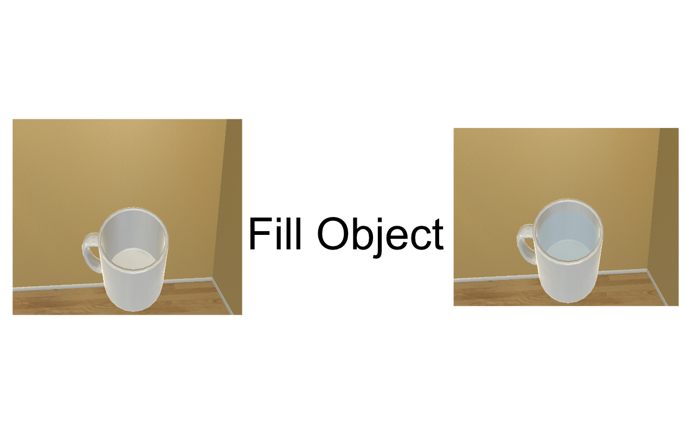
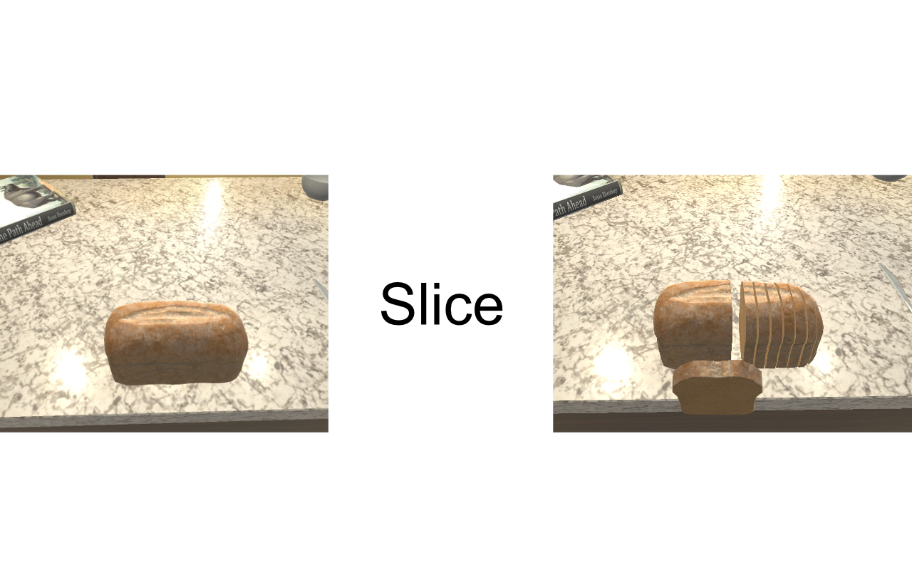
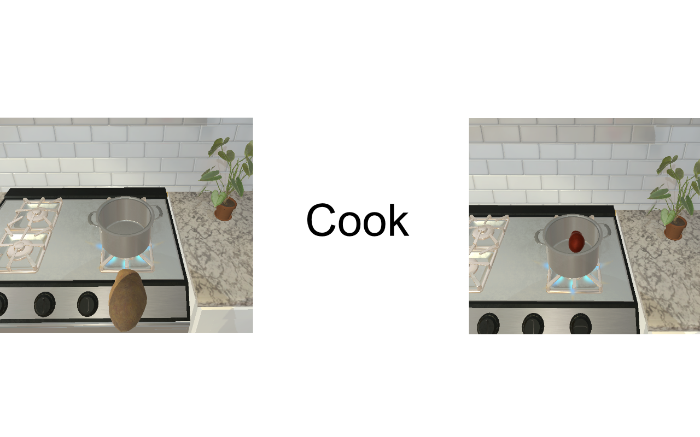
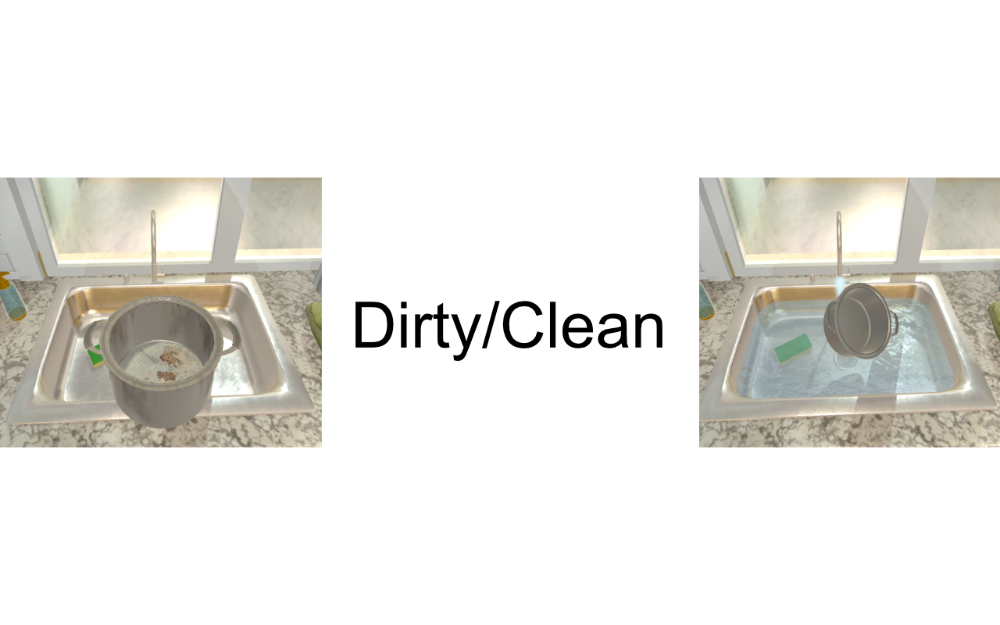
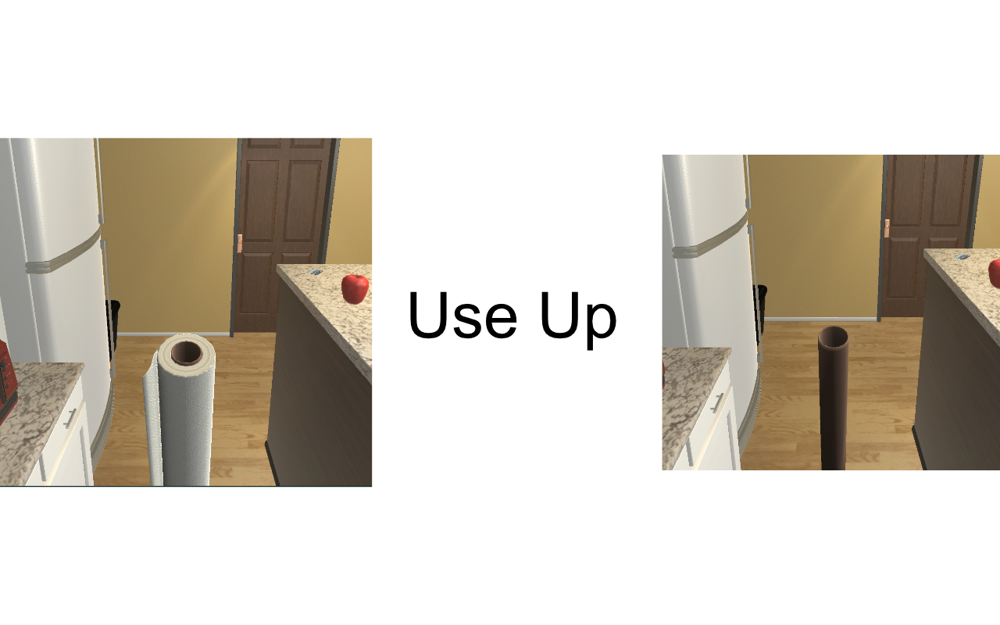

# AI2-THOR Version 2.0 Release Notes

## IMPORTANT NOTICE
Note that AI2-THOR 2.0 is not fully backwards compatible with previous versions due to some reworked architecture in the framework. For example, some object types have been deprecated (example: ToiletPaperRoll), new object types have been introduced (example: Faucet). Several scenes have also had their layout re-arranged, so objects are not guaranteed to be found in their same position, and as such the entire room itself might be different. Additionaly Metadata values might have been changed, added, or removed.

## More Sim Object Types
Additional Sim Object Types have been added to the framework
- Old Total Types: **105**
- New Total Types: **113**

Types Added:
- **Faucet**
- **ShowerHead**
- **AppleSliced**
- **EggCracked**
- **PotatoSliced**
- **LettucSliced**
- **TomatoSliced**
- **BreadSliced**

## New Object States, Properties, and Interactions Added
- Old interactions: openable, pickupable, on/off, receptacle
- New additional interactions: fillable, sliceable, cookable, breakable, dirty, used up

New states have been added to the framework, increasing the total number of different states to 10.

Some old object types have also been updated with increased functionality (ex: Shower Curtains and Blinds now Open). For the full table of object states and interactions, [see the documentation page](https://ai2thor.allenai.org/documentation/object-types/actionable-properties).

### New Physics and Material Properties Added to Objects
- **temperature** - abstracted temperature (Cold, Hot, Room Temp) is reported by all objects
- **mass** - all pickupable objects have a mass value in kilograms
- **salient materials** - return a list of observable materials an object is composed of (ie: Knife - Metal, Plastic)

### State Changes Added to Object Metadata
New metadata values have been added to represent new state changes:

- **isPickedUp**
- **breakable**
- **isBroken**
- **canFillWithLiquid**
- **isFilledWithLiquid**
- **dirtyable**
- **isDirty**
- **cookable**
- **isCooked**
- **sliceable**
- **isSliced**
- **canBeUsedUp**
- **isUsedUp**
- **objectTemperature**
- **canChangeTempToHot**
- **canChangeTempToCold**
- **salientMaterials**
- **mass**

Additionally, some Metadata values have been renamed for consistency, and certain depracated Metadata features have been removed.

Removed Metadata Values:
- **pivot**
- **pivotSimObjs**
- **receptacleCount**
- **bounds3d**
- **bounds**

### Contextual Interactions That Automatically Change States
Numerous objects can contextually change states and properties of other objects or themselves. These changes automatically take place in the environment without the need of explicit actions.

Some examples include:
- **Breakable objects will break if dropped with enough force**
- **Dirty dishwater will become clean if moved under running water**
- **Potatoes are cooked if moved over an active stove burner**
- **Fillable objects are filled with water if moved under a running water source**
- **Lit candles will be put out if placed in water**

Many object types can have multiple contextual interactions compatible with them (ie: Mugs can be dirty/clean, filled, and break). There too many Contextual Interactions to list all of them here. Please see the [documentation on our website](https://ai2thor.allenai.org/documentation/object-types/material-properties) for the full table of interactions.

## New Actions Added
Many new actions have been added in this release:

### State Change Actions
All state changes have an accompanying Action that can be used to change the state. Note that some states can also be changed automatically via contextual interactions as stated above.

New Actions include:
- **SliceObject**
- **BreakObject**
- **DirtyObject**
- **CleanObject**
- **FillObjectWithLiquid**
- **EmptyLiquidFromObject**
- **UseUpObject**

Please check our [full documentation](https://ai2thor.allenai.org/documentation/actions) for all details on Actions and any corresponding States.

### Agent Navigation/Manipulation Actions
Additional Agent Navigation actions have been added
- **Crouch** - Lower the Agent's camera
- **Stand** - Raise the Agent's camera back to eye level

### Interaction Actions
Additional Object Interaction Actions have been added
- **Push** - Push an object away from the agent with a specified force in Newtons
- **Pull** - Pull an object toward the agent with a specified force in Newtons

### Object State Randomization Actions
New actions have been added to allow random initialization of new object states:

- **RandomToggleStateOfAllObjects** - Randomly change all objects in the scene that have a different state.
- **RandomToggleSpecificState** - Randomly change all objects with a specified state.

### Temperature Manipulation Actions
New actions have been added to manipulate the new abstract Temperature properties:
- **SetRoomTempDecayTimeForType** - Change the time it takes for specific object types to return to room temperature
- **SetGlobalRoomTempDecayTime** - Change the time it takes for all objects to return to room temperature
- **SetDecayTemperatureBool** - Disable temperature decay over time

## Improved Documentation
[Documentation on the AI2-THOR website](https://ai2thor.allenai.org/documentation/installation) has been expanded to detail all functionality of this update. Additionally documentation has been re-arranged for ease of use.

