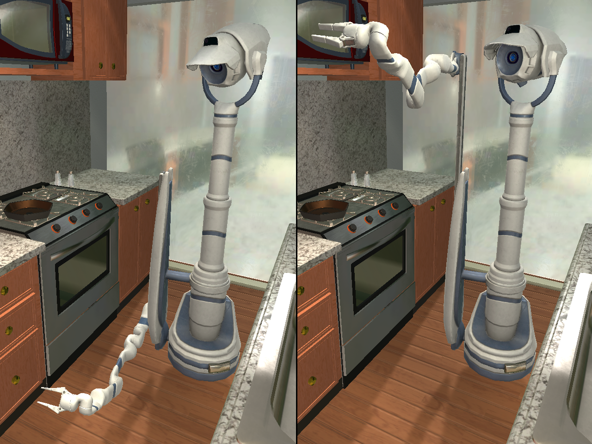

# AI2-THOR Version 3.0.0 Release Notes

## IMPORTANT NOTICE
Note that AI2-THOR 3.0.0 is not fully backwards compatible with previous versions due to updates and reworked architecture in the framework.

## ManipulaTHOR
ManipulaTHOR is a new environment within the AI2-THOR framework that facilitates visual manipulation of objects using a robotic arm.

Included with ManipulaTHOR is a range of new actions specific to arm manipulation:
- **MoveArm** - Uses inverse kinematics to manipulate the position of the robot arm's grasper.
- **MoveArmBase** - Adjusts the height of the arm by moving the base up and down.
- **PickupObject** - Picks up SimObjects with the arm's grasper.
- **ReleaseObject** - Drops any SimObjects picked up by the arm's grasper.
- **SetHandSphereRadius** - Adjust the radius of the arm's grasper.
- **MoveContinuous** - A new continuous movement that allows the arm to detect collisions while moving through a scene.
- **RotateContinuous** - A new continuous rotation that allows the arm to detect collisions while rotating within a scene.

The full details can be found in the [ManipulaTHOR Documentation here.](https://ai2thor.allenai.org/manipulathor/)

## Environmental Lighting Randomization
 

 

A new `RandomizeLighting` action has been added. This action allows a range of lighting changes across the `iTHOR`, `RoboTHOR`, and `ManipulaTHOR` environments to add more variation to a scene. `RandomizeLighting` has the following options to control how the light is randomized across a scene:
- **synchronized** - Denotes if all lights should be multiplied by the same random intensity and be randomized to the same color. When false, each light object is randomized independantly.
- **brightness** - Set the bounds with which light intensity is multiplied by.
- **randomizeColor** - Specifies if the color of light should be randomized, or if only the intensity should be randomized.
- **hue** - Provides a range of possible hue values for a light's color.
- **saturation** - Provides a range of possible saturation values for a light's color.

## Screenspace RayCast Coordinate Query

A new `GetCoordinateFromRaycast` action has been added. For a given (x, y) point in the agent's camera frame, it returns the global coordinate of the location where that RayCast hit some object.

## Updated Actions
The following actions have been updated as follows:

- **LookUp/LookDown/RotateRight/RotateLeft** - Improved logic to account for more precise collisions when an agent is holding an object while rotating.
- **GetReachablePositions** - Now enables getting positions relative to the agent rather than world coordinates.
- **SetObjectPoses** - Adds a `placeStationary` flag to this action that allows objects to be repositioned with kinematics set to true, preventing additional physics resolution after repositioning.
- **GetObjectInFrame** - Adds a new `checkVisible` param that when true will cause this action to perform an additional check if an object hit is not only within the frame, but also `visible` to the agent. Note that not all objects in frame are `visible` to the agent as they could be occluded or out of `maxVisibleDistance` range.
- **PutObject** - A new param `putNearXY` has been added, allowing the distance from the point hit by the RayCast to act as a heuristic for choosing where an object is placed within/on a receptacle. This allows more precise placement of objects in/on receptacles via (x,y) screenspace coordinates.

## Updated Metadata
- **objectOrientedBoundingBox** - All `pickupable` and `moveable` objects now have object oriented bounding boxes. Additionally, these object oriented bounds are now dynamically generated to account for state changes of some objects, like a `book` that can be closed or open.

## Updated Documentation
[Documentation on the AI2-THOR website](https://ai2thor.allenai.org/ithor/documentation/) has been expanded to detail all functionality of this update.

